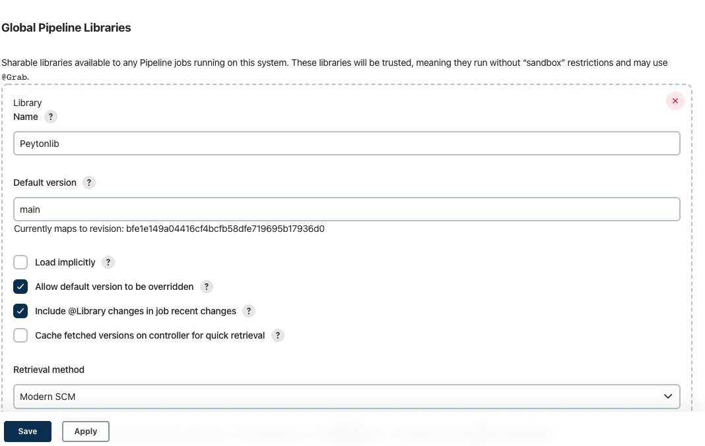
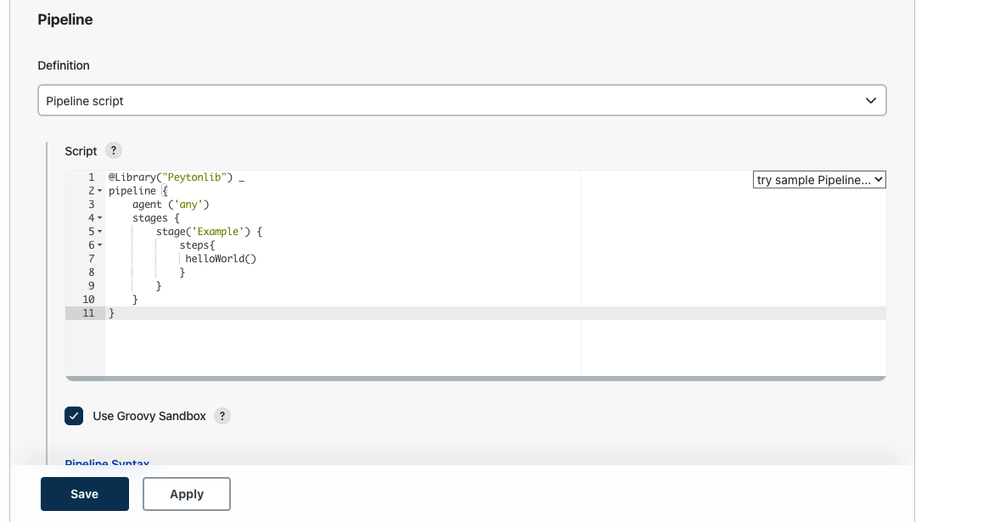

# jenkins-docker

##### This Repo allows user to Run Jenkins locally using docker. Please note this will not work with Zscalar running. 
##### Setup
```
docker build -t Jenkinsimg .
docker container run -d \
    -p 8080:8080 \       
    -v jenkisvol:/var/jenkins_home \
    --name jenkins-local-peytonimg \
    Jenkinsimg
```
###### After this go to http://localhost:8080 to view Jenkins Running!
###### Grab the Admin password
```
docker container exec \
    [CONTAINER ID or NAME] \
    sh -c "cat /var/jenkins_home/secrets/initialAdminPassword"
```
### Running HelloWorld with a Share Library
###### On the left side of Jenkins go to Manage Jenkins>Configure System>Global Pipeline Libraries
###### Next Add the the Git Lib you want to use and a branch from that git repo. In my example I called my lib Peytonlib and used the following git https://github.com/darinpope/github-api-global-lib.git

###### Click save
###### Next go to New Item>Pipeline>Advanced Project Options
###### Then enter the HelloWorld.groovy file into the pipeline script. Click save.

###### CLick on Build Now on the left side to Run the Pipeline